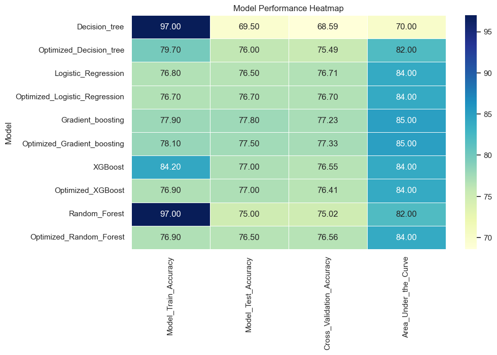

# PHASE-3: PREDICTION OF FLU SEASONAL VACCINE UPTAKE BY GENERAL PUBLIC

##   Overview 
Each year, the recurring flu season compels individuals to weigh the decision of whether to receive the flu vaccine. This decision is influenced with factors such as age groups, genders, and other relevant characteristics. Thus, the goal is to build a predictive model that anticipates people's choices in flu vaccination each year, utilizing historical data to uncover influential patterns. This model serves the primary purpose of aiding public health planning and decision-making. It provides vital insights into vaccination trends, allowing for more efficient resource allocation by the government health agencies. The initiative draws inspiration from past experiences, offering a data-driven approach to address future disease outbreaks and pandemics.

###   Objectives 
1. To examine the factors behind individuals' choices to get the annual flu vaccine without stating specific objectives.
2. To come up with strategies for targeting specific population segments to boost vaccination rates.
3. To explore variables like age categories, gender, and household composition to comprehend their statistical significance.
4. To construct a predictive model for assessing whether people would opt for the Seasonal Flu Vaccine under specific conditions or features.
5. To offer recommendations on increasing vaccination rates.

##   Data 
The project relied on H1N1_Flu_Vaccines.csv sourced from Kaggle https://www.kaggle.com/datasets/arashnic/flu-data, encompassing a comprehensive array of data pertaining to the respondents' socioeconomic and demographic profiles, alongside their perspectives regarding the H1N1 and seasonal flu vaccines. The dataset consisted of 26,707 rows and 38 columns, with 36 columns for features and 2 columns for targets. Descriptions of all the columns are found on https://www.drivendata.org/competitions/66/flu-shot-learning/page/211/.

##   Data understanding and Preparation 
The dataset was initially loaded and subjected to a data-cleaning process to ensure its readiness for analysis and machine learning modeling. It was observed that 24 out of the 38 columns had missing values, and 12 out of the 38 columns contained object data types, necessitating encoding for machine learning purposes.

Upon performing descriptive statistics, it became apparent that all the columns contained categorical data, which aligns with the expectations for classification modeling. To prepare the data for machine learning, missing values were imputed using the "SimpleImputer" from the Scikit-Learn Python module. Furthermore, the "LabelEncoder" from Scikit-Learn was employed to convert the categorical data (object type) into numerical values.

An Exploratory Data Analysis (EDA) was conducted to gain deeper insights into the dataset. Both Univariate and Bivariate Analyses were carried out on both the features and target variables.

####   Univariate Analysis 
***Results***

Based on the plots above, there is substantial portion of respondents that have some knowledge and concern, though it varies across levels. In terms of concern, most respondents are "Somewhat concerned," and in terms of knowledge, the majority have "A little knowledge." There's an imbalance in knowledge and concern levels.

From the visualizations,

Age Group: Our dataset is comprehensive for all age groups above 18 years, ensuring a robust representation.

Education: College graduates significantly dominate the dataset, accounting for a substantial portion of the records.

Race: The dataset exhibits a notable bias toward the white racial category, while other racial groups are underrepresented.

Sex: While there are more females than males in our dataset, the gender distribution remains relatively balanced, with males not significantly underrepresented.

Income Poverty: The majority of the population in our dataset falls within the income range between the poverty line and $75,000.

Marital Status: Both unmarried and married individuals are well-represented in the dataset, providing a diverse marital status profile.

Rent or Own: Homeowners make up the majority of the population, revealing an imbalance in this aspect of housing arrangements.

Employment Status: The dataset predominantly comprises individuals who are either employed or not in the labor force, offering a comprehensive overview of employment situations.

Residence: Majority of the respondents are not from the metropolitan statistical areas (MSA)' principal city. However, substantial number of them are from the MSA's principal city and others are Non-MSAs.

####   Bivariate/Multivariate Analysis 
***Results***

 **1= Not at all worried; 2 = Not very worried; 3 = Don't know; 4 = Somewhat worried; 5 = Very worried.**

The data suggests that respondents generally consider both H1N1 and seasonal vaccines to be moderately effective, with few believing them to be ineffective. Concerns about vaccination risks are low, with more moderate apprehension for the seasonal vaccine compared to H1N1. Interestingly, many respondents show little fear of getting sick after either vaccine. Overall, vaccine perceptions are positive, and worries about risks and sickness are limited.

Doctor's Recommendation for Seasonal Vaccine: A notable difference exists in the uptake of the seasonal vaccine concerning whether individuals received a recommendation for the H1N1 vaccine. Individuals who did not receive a recommendation for the H1N1 vaccine (coded as 0) showed a lower propensity to take the seasonal vaccine compared to those who received a recommendation (coded as 1). This observation suggests an association between recommendations for these two vaccines.

Health Insurance Status: A significant difference is observed between individuals with and without health insurance concerning their decision to take the seasonal vaccine. Those without health insurance displayed a lower likelihood of taking the vaccine, whereas individuals with insurance exhibited a more balanced distribution in their vaccine uptake.

Occupation as Health Worker: There is a marked contrast in the vaccination patterns between individuals employed as health workers and those in other occupations. A larger proportion of health workers opted to take the seasonal vaccine, while a substantial majority of non-health workers chose not to receive it.

Marital Status: Among individuals who are not married, a substantial portion opted for vaccination, and the distribution was relatively even. In contrast, the married population displayed a more uniform distribution with respect to vaccine uptake.

Chronic Medical Conditions: The presence of chronic medical conditions significantly influenced the seasonal vaccine intake. Individuals with chronic medical conditions exhibited a higher vaccination rate, while those without such conditions displayed a lower likelihood of vaccine uptake.

Following the analysis, it was determined that, as per project requirements (involving the use of one target variable), 21 column features and 1 target variable were dropped from the dataset to prepare for the machine learning modeling phase.

##   Modelling 
The dataset, comprising 22 columns (21 features and 1 target variable), underwent preprocessing to separate the features from the target variable. Subsequently, the data was split into training and testing sets to prevent data leakage during machine learning modeling. Initially, a Decision Tree classifier model, with default parameters, served as the base model for the analysis. Later, a series of models, including Optimized Decision Tree, Logistic Regression, Optimized Logistic Regression, Gradient Boosting, Optimized Gradient Boosting, XGBoost, Optimized XGBoost, Random Forest, and Optimized Random Forest, were employed. The term "Optimized models" indicates that these models were trained with hyperparameters optimized for performance. Each model's performance was assessed based on prediction accuracy on both the training and testing datasets. Various evaluation metrics were employed, encompassing precision, recall, F1 Score, Learning Curves, Receiver Operating Characteristic (ROC) curves, and Area Under the Curve (AUC) values. These metrics provide a comprehensive understanding of each model's predictive capabilities and generalization performance.

##   Evaluation 
Since majority of the above trained machine learning models exhibited robust balance on the bias trade off in precision, recall, F1 score, they were evaluated on the following bases:
1. Prediction accuracy on the training and testing/validation sets
2. Area under the curve using Receiver Operating Characteristic (ROC) curves.
3. Consistency in prediction accuracy of both training and validation sets to avoid underfitting/overfitting.

####    Results 

Starting with the Decision Tree model, it initially shows high training accuracy but struggles with overfitting, resulting in lower generalization on the test and cross-validation datasets. The Optimized Decision Tree improves but doesn't outperform other models due to its lower AUC.

Logistic Regression exhibits balanced performance, yet it isn't the best model. Its optimized version maintains reliability in flu vaccine likelihood prediction but doesn't outshine other models.

The Random Forest model excels in training accuracy but faces overfitting, resulting in a drop in test and cross-validation performance. Its optimized counterpart offers balance but doesn't outperform others.

XGBoost performs well in identifying flu vaccine likelihood but exhibits a minor test accuracy drop. The Optimized XGBoost maintains reliability in predictions but doesn't stand out.

Gradient Boosting showcases notable accuracy and predictive power. Its optimized version further enhances performance. However, it isn't the best model, as a superior option is available.

In the end, the Optimized Gradient Boosting model emerges as the best choice, offering high accuracy, robust generalization, and strong flu vaccine likelihood predictions, making it the top candidate among the models.

##   Conclusion 
***Understanding Factors Influencing Flu Vaccine Choices:***
The analysis has provided valuable insights into the factors that influence individuals' choices to receive the annual flu vaccine. Although the dataset used offers intriguing insights, it exhibits noticeable bias towards specific communities, socioeconimic classes and demographic groups. 

***Targeting Specific Population Segments:***
The analysis offers an opportunity to develop targeted strategies for improving vaccination rates. By identifying variables with higher statistical significance, such as age categories, gender, individual's opinions, concerns and knowledge about the vaccines,  the government health agencies can tailor vaccination campaigns to address the unique needs and preferences of different population segments.

***Exploring Statistical Significance:***
The analysis explores the statistical significance of variables, including age_group, opinion_seas_risk, employment_industry, doctor_recc_seasonal, opinion_seas_vacc_effective, opinion_h1n1_risk, doctor_recc_h1n1, chronic_med_condition, household_children, health_worker, h1n1_concern, opinion_h1n1_vacc_effective, rent_or_own, behavioral_touch_face, h1n1_knowledge. It highlights the importance of these variables in predicting vaccination decisions and can guide further investigations or interventions.

***Constructing Predictive Models:***
The project has successfully constructed predictive models to assess whether people are likely to opt for the seasonal flu vaccine under specific conditions or features. Optimized models like Gradient Boosting and XGBoost have shown promise in predicting vaccine choices based on various attributes. However, tuned Gradient Boosting outperforms XGBoost with optimized parameters in terms of performance.

In summary, the analysis has not only achieved its objectives but also paved the way for evidence-based strategies to government public agencies to enhance flu vaccination rates and tailor interventions to specific population segments.

####    Limitations 
1. The dataset used in the analysis was biased and not representative of a wide demographic. This may lead to poor generalization of the predictive model.
2. The model performance left out the time metric required to train various models and therefore training time of each model was not evaluated.
3. Some population segments have lower vaccination rates due to a lack of awareness about the benefits of the Seasonal Flu Vaccine. This affects model generalization.

##   Recommendations 
1. Diverse Data Collection: To mitigate bias, collect data that more accurately represents a wider demographic and geographic range. Ensure data collection from a more diverse set of communities and population groups
2. Awareness Campaigns: Develop targeted awareness campaigns to educate people about the benefits of the Seasonal Flu Vaccine, particularly focusing on population segments with lower vaccination rates.
3. Improve Data Balance: Work on improving the balance of the dataset to ensure that models generalize well to a broader population. Techniques like oversampling or gathering more data from underrepresented groups may help.
4. Continual Monitoring: Maintain continuous monitoring of vaccination rates and effectiveness. This will help adapt strategies in real-time and ensure the most relevant actions are taken and change the opinions of vaccine risks and illness perception among some individuals.
5. Model Refinement: To improve predictive models, it is essential to focus on optimizing techniques, particularly for the Gradient Boosting model. Further fine-tuning its parameters has the potential to enhance its performance. Additionally, a thorough evaluation of the time required to train various models is crucial to ensure efficiency and streamline the modeling process.